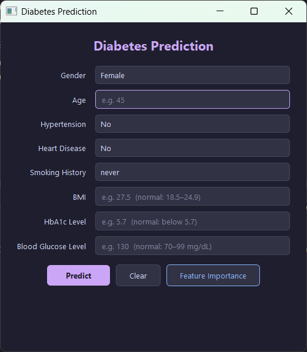
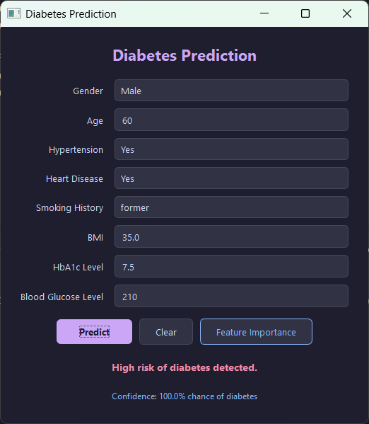
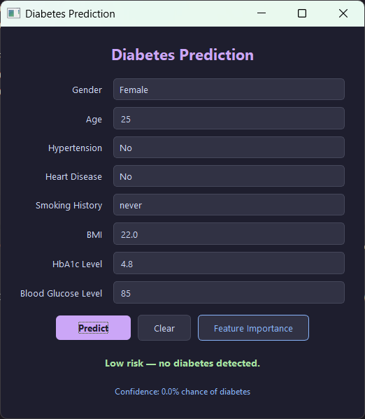
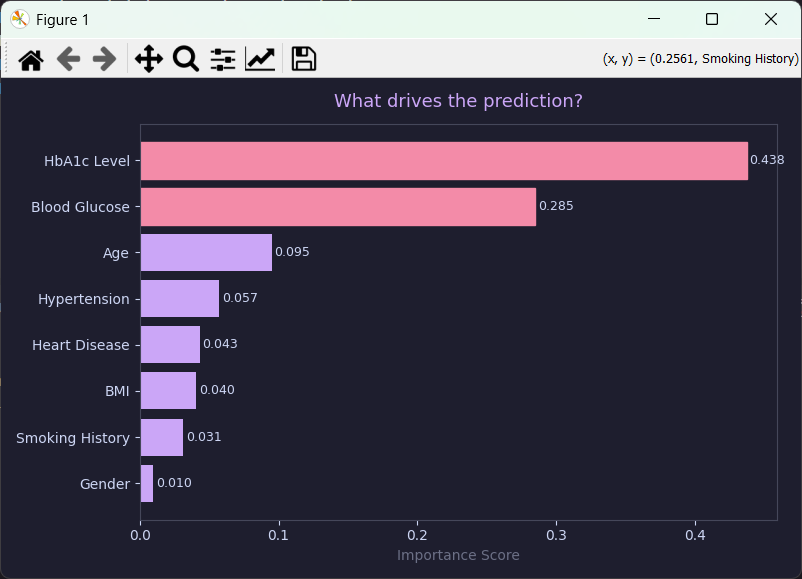

# Diabetes-Risk-Prediction-System
Machine learning-based diabetes risk prediction system using XGBoost trained on 100,000 healthcare records with 96.8% prediction accuracy.

---

## Table of Contents

- [Overview](#overview)
- [Features](#features)
- [Tech Stack](#tech-stack)
- [Project Structure](#project-structure)
- [Requirements](#requirements)
- [Getting Started](#getting-started)
- [Input Fields](#input-fields)
- [Model Details](#model-details)
- [Dataset](#dataset)
- [Screenshots](#screenshots)
- [Disclaimer](#disclaimer)
- [License](#license)

---

## Overview

This application trains an XGBoost classifier on a clinical diabetes dataset and exposes it through a clean, dark-themed desktop GUI. Users enter patient data, receive an instant risk prediction with a confidence score, and can explore a feature importance chart to understand which factors drive the prediction.

---

## Features

- **Risk Prediction** — Classifies patients as high-risk or low-risk for diabetes with a confidence percentage.
- **Feature Importance Chart** — Interactive horizontal bar chart showing which clinical factors most influence the model's decision.
- **Automatic Model Training** — On first launch, the model is trained and saved locally. Subsequent launches load the pre-trained model for instant startup.
- **SMOTE Balancing** — Handles class imbalance in the training data via Synthetic Minority Over-sampling Technique.
- **Input Validation** — Validates all numeric inputs before prediction with clear error messages.
- **Modern UI** — Dark Catppuccin-themed interface built with PyQt5.

---

## Tech Stack

| Layer | Technology |
|---|---|
| GUI | PyQt5 |
| ML Model | XGBoost (`XGBClassifier`) |
| Data Processing | pandas, NumPy, scikit-learn |
| Class Balancing | imbalanced-learn (SMOTE) |
| Visualization | Matplotlib |
| Model Persistence | pickle |

---

## Project Structure

```
Diabetes Risk Prediction System/
├── app.py                          # Main application — model training, UI, and prediction logic
├── Data/
│   ├── diabetes_prediction_dataset.csv   # Training dataset
│   └── model.pkl                         # Serialized model (auto-generated on first run)
└── README.md
```

---

## Requirements

- Python 3.8 or higher

Install all dependencies:

```bash
pip install numpy pandas matplotlib xgboost scikit-learn imbalanced-learn PyQt5
```

---

## Getting Started

1. **Clone the repository**

   ```bash
   git clone <repository-url>
   cd "Diabetes Risk Prediction System"
   ```

2. **Install dependencies**

   ```bash
   pip install numpy pandas matplotlib xgboost scikit-learn imbalanced-learn PyQt5
   ```

3. **Run the application**

   ```bash
   python app.py
   ```

   On first launch, the model trains automatically using the dataset in `Data/`. Training progress and accuracy are printed to the console. Once complete, the GUI opens.

---

## Input Fields

| Field | Type | Description |
|---|---|---|
| Gender | Dropdown | Female / Male / Other |
| Age | Numeric | Patient age in years |
| Hypertension | Dropdown | Whether the patient has hypertension |
| Heart Disease | Dropdown | Whether the patient has heart disease |
| Smoking History | Dropdown | never / No Info / current / former / ever / not current |
| BMI | Numeric | Body Mass Index (normal: 18.5–24.9) |
| HbA1c Level | Numeric | Glycated haemoglobin percentage (normal: below 5.7) |
| Blood Glucose Level | Numeric | Fasting blood glucose in mg/dL (normal: 70–99) |

---

## Model Details

| Parameter | Value |
|---|---|
| Algorithm | XGBoost (`XGBClassifier`) |
| Estimators | 500 |
| Max Depth | 6 |
| Learning Rate | 0.03 |
| Subsample | 0.8 |
| Class Balancing | SMOTE |
| Train / Test Split | 80% / 20% (stratified) |
| Feature Scaling | `StandardScaler` |

---

## Dataset

The model is trained on `diabetes_prediction_dataset.csv`, which contains labeled patient records with the clinical and demographic features listed above. The target variable is `diabetes` (binary: 0 = no diabetes, 1 = diabetes).

---

## Screenshots

### 1. Prediction Dashboard
Enter patient health indicators and generate a diabetes risk prediction.



---

### 2. High-Risk Diabetes Detection
Prediction result indicating elevated diabetes risk with confidence score.



---

### 3. Low-Risk Assessment
Prediction result indicating low diabetes risk based on patient health indicators.



---

### 4. Feature Importance Analysis
Interactive chart showing which clinical factors most influence the model's prediction.



---

## Disclaimer

This application is intended for **educational and research purposes only**. It is not a substitute for professional medical advice, diagnosis, or treatment. Always consult a qualified healthcare provider for medical decisions.

---

## License

This project is licensed under the [MIT License](https://opensource.org/licenses/MIT).
